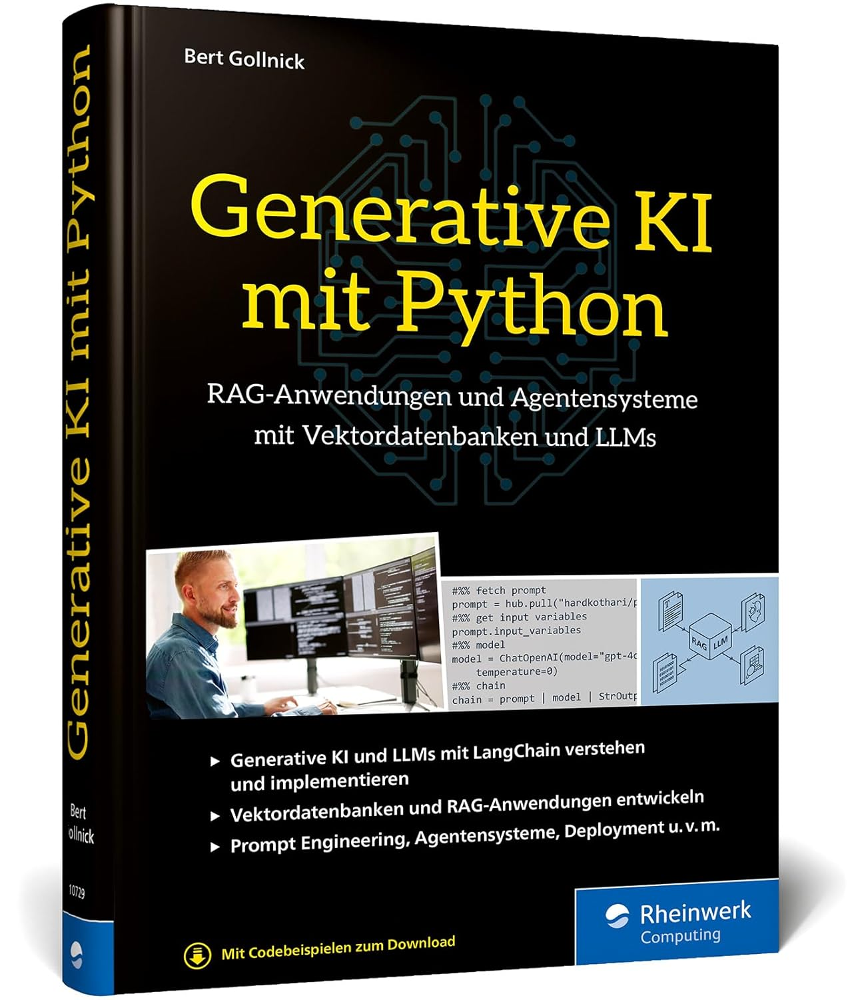

# Generative KI mit Python

Dies ist das zugehörige Buch zum Online-Kurs.
<table>
  <tr>
    <td align="center">
      <a href="https://www.sap-press.com/generative-ai-with-python_6057/?irclickid=xWb30oxMvxycRtAW1lQdDXCVUksW5%3AQ02Q5DUE0&sharedid=&irpid=6210658&utm_medium=Affiliate&irgwc=1" target="_blank">
        <br/>
        <b>English Edition</b>
      </a><br/>
      <span>A comprehensive guide to generative AI concepts and coding in Python.</span>
    </td>
    <td align="center">
      <a href="https://gollnickdata.de/#/genai_book_de" target="_blank">
        <br/>
        <b>Deutsche Ausgabe</b>
      </a><br/>
      <span>Ein umfassender Leitfaden zu generativer KI mit Python.</span>
    </td>
  </tr>
</table>


# Installation

## Environment

### Environment using `venv`

#### Installation und Aktivierung auf Mac/Linux:

```bash
python -m venv .venv
source .venv/bin/activate
```

#### Installation und Aktivierung auf Windows:

```bash
python -m venv .venv
.venv\Scripts\activate
```

#### Pakete installieren

Die benötigten Pakete sind in der requirements.txt Datei aufgelistet. Diese kann mit folgendem Befehl installiert werden:

```bash
pip install -r requirements.txt
```

Sofern die Pakete nicht installiert werden können, kann man sie auch einzeln installieren.

```bash
pip install <paketname>
```

### Environment using `uv`

```bash
pip install uv
```

## Install dependencies

```bash
uv sync
```